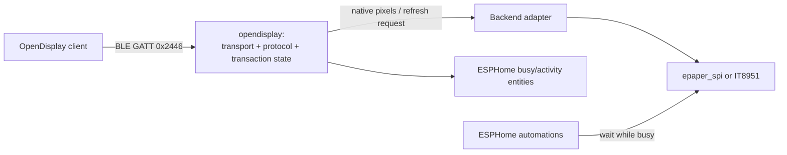
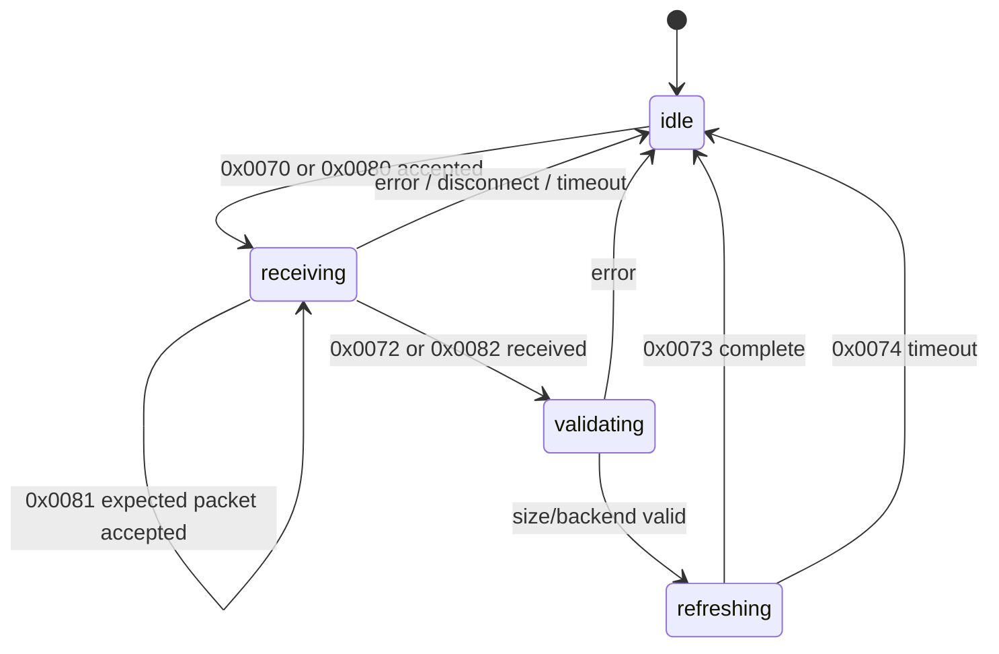

# OpenDisplay ESPHome Component Plan

## Objective

Build `opendisplay:` as an ESPHome external component that implements focused OpenDisplay direct-write and PIPE_WRITE profiles for e-paper devices using either `epaper_spi` or `it8951`.

`opendisplay` accesses its configured display directly. It is not a display arbiter or manager. To support coexistence with local ESPHome automations, it exposes busy/activity state; any other automation that writes to the same display must check or wait for that state.

## Architecture



### Component boundaries

| Layer | Responsibility | Constraint |
|---|---|---|
| BLE transport | Provide service and characteristic UUID `0x2446`; accept writes and send notifications. | BLE callbacks only queue bounded work. They never wait on panel BUSY, render, or access SPI. |
| Protocol engine | Parse commands, return ACK/error responses, expose fixed configuration, and enforce one active transaction. | Capabilities are generated from ESPHome YAML/backend configuration, not independently editable over the wire. |
| Transfer engine | Count bytes, enforce expected frame/region size, cancel on disconnect/timeout, and advance work in `loop()`. | No unbounded allocation or per-packet `std::vector`. |
| Backend adapter | Convert OpenDisplay pixel data to an `epaper_spi` buffer or IT8951 controller-RAM writes, then request refresh. | Advertise only capabilities actually supported by the selected panel/backend. |
| ESPHome integration | Publish coordination state and events. | This is cooperative coordination, not arbitration. |

## ESPHome-facing contract

Illustrative YAML:

```yaml
epaper_spi:
  id: panel
  model: seeed_e1004
  update_interval: never

opendisplay:
  id: od
  display: panel

binary_sensor:
  - platform: opendisplay
    opendisplay_id: od
    name: OpenDisplay Busy
```

The proposed component surfaces are:

| Surface | Behavior |
|---|---|
| `opendisplay.is_busy` condition | True from an accepted image start until success, timeout, abort, or disconnect cleanup. |
| Busy binary sensor | Optional Home Assistant-visible state for YAML `wait_until` and diagnostics. |
| Activity text sensor | Optional values: `idle`, `receiving`, `writing`, `refreshing`, `error`. |
| Automation events | `on_transfer_started`, `on_refresh_complete`, `on_error`. |

Example of a local automation voluntarily waiting before directly using the same driver:

```yaml
script:
  - id: show_local_status
    mode: queued
    then:
      - wait_until:
          condition:
            not:
              opendisplay.is_busy: od
      - lambda: |-
          id(panel).update();
```

`busy` must remain asserted during the physical e-paper refresh, not just while pixels are received.

## Protocol profile

**Profile name:** OpenDisplay ESPHome Direct-Write and PIPE_WRITE Profile.

Initial transport is BLE GATT, using service and characteristic UUID `0x2446`. The component implements both documented full-frame transfer sequences:

```text
Direct write: 0x0070 start → 0x0071 data (repeated) → 0x0072 end → 0x0073 complete
PIPE_WRITE:   0x0080 start → 0x0081 data (windowed) → 0x0082 end → 0x0073 complete
```

Direct write is the compatibility path: it ACKs each data packet before the client sends the next. PIPE_WRITE is the preferred high-throughput path. It allows at most **16 packets in flight** and returns a cumulative progress ACK after each group of **four consecutively accepted packets**. The device may send an earlier ACK on an error, timeout, end request, or disconnect.

PIPE_WRITE deliberately has **no reorder queue**. The receiver accepts only the next expected packet sequence, streams it to the backend/staging buffer, and advances its contiguous-received counter. An out-of-order packet is not retained; the device responds with the last cumulative ACK so the client can resend from that point. This keeps RAM bounded and makes the transfer engine deterministic.

The parser should be transport-neutral so a future OpenDisplay LAN/TCP transport can reuse it, but TCP is not part of v1.

## Commands to implement

| Opcode | Direction / purpose | Proposed v1 behavior | Status |
|---|---|---|---|
| `0x0040` | Client → device: read configuration | Return read-only generated configuration chunks. Report dimensions, color scheme, refresh modes, partial capability, and the direct-write and PIPE_WRITE transmission modes supported by the configured backend. | Implement v1 |
| `0x0043` | Client → device: firmware version | Return OpenDisplay component and firmware version. Keep this readable without a session if encryption is added. | Implement v1 |
| `0x0070` | Client → device: direct-write start | Open one full-frame transaction. In v1, accept the uncompressed empty-payload form only. | Implement v1 |
| `0x0071` | Client → device: direct-write data | Accept bounded native-format row-major pixels; ACK each accepted chunk; count bytes. | Implement v1 |
| `0x0072` | Client → device: direct-write end | Validate exact expected size, ACK, request an advertised refresh mode, then enter `refreshing`. | Implement v1 |
| `0x0073` | Device → client: refresh complete | Notify only after the driver/controller confirms refresh completion. Clear `busy` and publish completion event. | Implement v1 |
| `0x0074` | Device → client: refresh timeout | Notify if physical refresh does not complete in time. Clear `busy`, publish error, and invalidate partial-update state. | Implement v1 |
| `0x0080` | Client → device: PIPE_WRITE start | Open a full-frame windowed transaction. Advertise it only when the selected backend can accept the stream. | Implement v1 |
| `0x0081` | Client → device: PIPE_WRITE data | Accept only the next expected packet; permit at most 16 unacknowledged packets from the client; send a cumulative ACK after every four accepted packets. Do not retain out-of-order packets. | Implement v1 |
| `0x0082` | Client → device: PIPE_WRITE end | Require all bytes through the final contiguous packet, validate exact frame size, ACK, and begin refresh. | Implement v1 |
| `0x0076` | Client → device: partial-region write start | Add only with a backend/model gate. Initially limit to safe, documented 1-bpp implementations. | Later / capability-gated |
| `0x0050` | Client ↔ device: authentication | Add AES-128 session authentication after baseline interoperability is proven. Do not reuse ESPHome native-API encryption keys. | Later / capability-gated |

### Response rules

- Direct-write ACK success: `0x00` followed by the relevant command low byte; ACK every accepted `0x0071` packet.
- PIPE_WRITE ACK: cumulative acknowledgement of the highest consecutive packet received. Emit after every four accepted `0x0081` packets; never allow more than 16 packets to remain unacknowledged.
- Error: `0xFF` followed by the relevant command low byte.
- `0x0073` is sent only after refresh completion.
- `0x0074` is sent after a physical refresh timeout.
- A backend must not claim partial refresh, compression, or a color format merely because another OpenDisplay device supports it.

## Commands not to implement

| Opcode(s) | Reason | Status |
|---|---|---|
| `0x000F` | Reboot belongs to ESPHome lifecycle/control, not display transfer. | Do not implement |
| `0x0041`, `0x0042` | Remote configuration write conflicts with ESPHome YAML/code generation as the configuration authority. | Do not implement |
| `0x0045` | Clearing a stored Flex configuration is irrelevant when capability data derives from compiled ESPHome configuration. | Do not implement |
| `0x0044` | Manufacturer-specific data is optional and needs a separate ESPHome definition before it has useful semantics. | Do not implement v1 |
| `0x0051`, `0x0052` | DFU and deep sleep belong to ESPHome OTA/power management. | Do not implement |
| `0x0064`, `0x0065` | Block upload is not implemented in the reference firmware and is unnecessary for streaming direct write. | Do not implement |
| `0x0075`, `0x0077` | LED and buzzer controls are unrelated to e-paper transfer; use separate ESPHome components if needed. | Do not implement |
| `0x0083` | NFC endpoint is BG22-specific and outside the ESPHome e-paper scope. | Do not implement |

## Backend requirements

| Backend | Initial data path | Initial capability set | Important limit |
|---|---|---|---|
| `epaper_spi` | Write into a component-owned native-format frame/staging buffer, then call a supported refresh hook. | Full-frame direct write and PIPE_WRITE; full refresh. | Larger panels need PSRAM or another safe bounded-buffer strategy. Add partial support only per validated panel model. |
| `it8951` | Stream chunks through a narrow adapter into IT8951 image RAM, then issue controller refresh. | Full-frame direct write and PIPE_WRITE; accurately report controller-supported refresh modes. | Pixel conversion, byte packing, and region alignment must be explicit. |

Avoid private-driver-member access or SPI `reinterpret_cast` shortcuts. Add small upstreamable hooks or maintain narrow adapter extensions for the two supported driver families.

## Transaction state machine



Rules:

- Accept only one transfer at a time.
- For PIPE_WRITE, accept in-order packets only; do not allocate a reorder queue. Cap client in-flight packets at 16 and issue a cumulative ACK for each four-packet group.
- Treat a client that exceeds the 16-packet window as a protocol violation: send an error/last cumulative ACK and abort the transaction rather than buffering excess data.
- Reject a new transfer while a current transaction is receiving, writing, or refreshing.
- An invalid command, overflow/underflow, backend error, client disconnect, or transfer timeout aborts the transaction, releases resources, and clears `busy`.
- Slow work occurs from the component loop/state machine, not from the BLE write callback.

## Delivery sequence

| Milestone | Deliverable | Acceptance check |
|---|---|---|
| M1 | External-component skeleton, BLE `0x2446` service, fixed config/version responses, busy entity. | Client discovers device, reads configuration, and observes activity state. |
| M2 | Uncompressed full-frame direct-write `0x0070`/`0x0071`/`0x0072` flow through IT8951. | Exact-size frame reaches controller RAM; `0x0073` follows real completion. |
| M3 | PIPE_WRITE `0x0080`/`0x0081`/`0x0082` transfer engine: in-order only, 16-packet cap, four-packet cumulative ACK cadence, no reorder queue. | A client transfers a full frame at the advertised window limit; loss/out-of-order tests cause resend from the last cumulative ACK without excess buffering. |
| M4 | `epaper_spi` full-frame adapter and PSRAM/bounded-buffer policy. | Compatible mono panel displays a complete frame without concurrent driver writes. |
| M5 | Disconnect/error cleanup, refresh timeout, capability-conformance tests, and ESPHome automation examples. | No stuck busy state; unsupported features are never advertised. |
| M6 | Partial `0x0076`, authentication, and compression as independent capability-gated additions. | Each feature passes protocol and panel-model-specific tests before advertisement. |

## References

- [OpenDisplay communication protocol](https://opendisplay.org/protocol/ble-flow.html)
- [OpenDisplay display data format](https://opendisplay.org/protocol/display-data-format.html)
- [OpenDisplay protocol index](https://opendisplay.org/protocol/)
+

## Implementation guide

This section is normative for implementation. Where it refers to a packet field or byte layout, use the current OpenDisplay protocol specification and reference Firmware as the source of truth; do not create an ESPHome-specific wire encoding.

### Repository layout

Place the external component in a repository usable by ESPHome external-components:

~~~text
components/
  opendisplay/
    __init__.py                 # CONFIG_SCHEMA and C++ code generation
    manifest.json               # dependencies and minimum ESPHome version
    opendisplay.h/.cpp          # Component owner, state machine, loop()
    protocol_types.h            # typed commands, responses, errors, capabilities
    protocol.h/.cpp             # parsing/encoding; independent of BLE and driver
    transfer_engine.h/.cpp      # Direct Write and PIPE_WRITE accounting
    ble_transport.h/.cpp        # GATT bindings and bounded RX/TX handling
    backend.h                   # hardware-neutral narrow adapter interface
    backend_it8951.h/.cpp       # IT8951 adapter
    backend_epaper_spi.h/.cpp   # ePaper SPI adapter
    entities.h/.cpp             # busy/activity entities and triggers
    tests/                      # host-testable protocol/transfer tests
examples/
  it8951_full_frame.yaml
  epaper_spi_mono.yaml
  epaper_spi_spectra_e6.yaml
~~~

Keep protocol, transfer-engine, and protocol-types modules free of ESPHome/ESP-IDF headers where practical. They must be unit-testable with a fake backend and fake transport.

### ESPHome code-generation contract

The Python code-generation module must:

1. Declare OpenDisplayComponent as an ESPHome Component and use ESPHome BLE-server infrastructure.
2. Require exactly one display ID.
3. Accept only explicitly supported C++ display types and choose the adapter at code-generation time: IT8951Backend for it8951 and EpaperSPIBackend for epaper_spi.
4. Validate fixed v1 limits: one active transfer, PIPE window 16, PIPE ACK cadence 4, and bounded timeout values.
5. Generate the backend instance before component registration.
6. Reject an unsupported display ID with a clear configuration error.

Do not select a backend by runtime platform name and do not advertise generic support for every ESPHome display component.

### Recommended YAML shape

~~~yaml
external_components:
  - source: github://OpenDisplay/esphome-opendisplay

epaper_spi:
  id: panel
  model: seeed_e1004
  update_interval: never

opendisplay:
  id: od
  display: panel
  transport: ble
  transfer_timeout: 30s
  refresh_timeout: 180s
  on_transfer_started:
    - logger.log: "OpenDisplay transfer started"
  on_refresh_complete:
    - logger.log: "OpenDisplay refresh complete"
  on_error:
    - logger.log: "OpenDisplay error"

binary_sensor:
  - platform: opendisplay
    opendisplay_id: od
    name: OpenDisplay Busy
    id: od_busy
~~~

For epaper_spi, set update_interval: never whenever OpenDisplay can write the panel. This prevents automatic scheduled refreshes, but is not a locking mechanism. Local code must use the busy condition before it accesses the same display.

### ESPHome public surfaces

| Surface | Required behavior |
|---|---|
| opendisplay.is_busy condition | True from accepted start through terminal state. |
| Busy binary sensor | Defaults false at boot; publishes on every busy transition. |
| Activity text sensor | Publishes idle, receiving, validating, writing, refreshing, or error. |
| on_transfer_started | Fires once after a start is accepted. |
| on_refresh_complete | Fires once after actual physical refresh completion. |
| on_error | Fires after a terminal error is recorded. |
| Optional opendisplay.abort action | Cancels a receiving transaction; does not promise to stop an issued refresh. |

## Backend adapter API

Use a deliberately narrow adapter. It must neither expose raw SPI nor require access to private driver state.

~~~cpp
class OpenDisplayBackend {
 public:
  virtual const DisplayCapabilities &capabilities() const = 0;
  virtual BackendResult begin_frame(const FrameDescriptor &frame) = 0;
  virtual BackendResult write_contiguous(uint32_t offset,
                                         const uint8_t *data,
                                         size_t length) = 0;
  virtual BackendResult finish_frame() = 0;
  virtual BackendResult begin_refresh(RefreshRequest request) = 0;
  virtual PollResult poll_refresh() = 0;  // pending, complete, failed
  virtual void abort_transfer() = 0;
};
~~~

Rules:

- write_contiguous receives monotonically increasing offsets in v1.
- begin_frame may reserve/preclear staging storage or configure an IT8951 memory load.
- finish_frame performs final validation or bounded conversion.
- begin_refresh returns quickly. poll_refresh is called from loop; never block in a BLE callback.
- abort_transfer releases transfer resources and leaves the backend defined.
- The adapter returns typed errors; it never sends BLE responses itself.

One DisplayCapabilities model must drive both the backend and the 0x0040 response:

~~~text
width, height, rotation
accepted OpenDisplay pixel format(s)
full-frame wire byte count
row/byte alignment
full refresh modes
partial support and region alignment, if implemented
Direct Write and PIPE_WRITE availability
maximum contiguous write size
staging location and required bytes
~~~

### IT8951 adapter requirements

- Stream contiguous accepted chunks into IT8951 image RAM; do not require a full MCU frame buffer.
- Define input format, grayscale conversion, bit/byte packing, row stride, target-memory address, and alignment explicitly.
- Fixed-size conversion scratch is acceptable.
- Advertise only proven refresh modes for the selected IT8951/panel configuration.

### ePaper SPI adapter requirements

- v1 supports full frame plus full refresh.
- Allocate one component-owned native-layout buffer at setup, preferably PSRAM for large panels. Fail setup clearly if storage is insufficient.
- Convert/validate each packet into the exact full-frame offset.
- Commit through a deliberately exposed safe driver hook; never access a private framebuffer or rely on undocumented ordering.
- Add panel models only after byte packing, color mapping, buffer size, and BUSY behavior tests pass.

## Transfer-engine implementation details

### Shared transaction fields

Use one Transaction structure, fully reset between sessions:

~~~text
mode (direct | pipe)
connection generation
state
expected_frame_bytes
accepted_bytes
next_direct_offset
next_pipe_sequence
last_cumulative_ack
accepted_since_ack
transfer_deadline
refresh_deadline
backend frame descriptor
terminal error
~~~

All offset/size arithmetic must be checked before buffer access. A transfer is valid only when accepted_bytes exactly equals the advertised full-frame byte count at end.

### Direct Write algorithm

1. Receive 0x0070, validate idle state and full-frame descriptor, and set busy true.
2. In the main component loop call backend.begin_frame and set expected offset to zero.
3. For each 0x0071, require the next contiguous payload, write it at the expected offset, and advance only after backend success.
4. Emit canonical ACK after every accepted data packet.
5. On 0x0072, require exact final byte count and call backend.finish_frame.
6. ACK accepted end, call begin_refresh, and enter refreshing.
7. Poll completion in loop. Emit 0x0073 only after actual completion.

### PIPE_WRITE algorithm

PIPE_WRITE is strictly in order.

| Parameter | Required v1 value |
|---|---:|
| Maximum client packets in flight | 16 |
| Cumulative ACK cadence | every 4 consecutive accepted packets |
| Reorder queue | none |
| Storage for future/out-of-order packets | none |
| Backend write order | contiguous only |

1. 0x0080 initializes next sequence, byte offset zero, last cumulative ACK, and accepted-since-ACK counter.
2. Each 0x0081 must carry the next expected sequence/index and a valid bounded payload.
3. If expected, call write_contiguous, advance sequence/byte count, and increment accepted-since-ACK.
4. At four accepted packets, send cumulative ACK for the highest contiguous sequence, update last cumulative ACK, and reset the counter.
5. On duplicate or out-of-order data, do not retain it. Immediately send the most recent cumulative ACK so the client resumes at the latest known contiguous position.
6. If the client exceeds the 16-packet advertised window, send defined error/last cumulative ACK and abort. Do not buffer excess data.
7. On 0x0082, require no sequence gap and exact bytes. If one to three packets remain since the prior ACK, send final cumulative ACK before finish/refresh.

Use canonical OpenDisplay sequence and ACK fields. An ACK represents the highest contiguous accepted packet only.

### Callback, queue, and concurrency rules

The BLE write callback performs only connection/state check, payload-length bound check, fixed-buffer copy/enqueue, and immediate rejection when the queue is full. It must not allocate a frame, convert pixels, access SPI, or wait for BUSY.

Use fixed-capacity descriptors:

~~~text
connection generation
opcode
payload length
payload block index or inline bytes
arrival timestamp
~~~

Treat BLE callbacks and ESPHome loop as distinct execution contexts. Protect queue handoff with the appropriate critical section. Only loop changes backend state and terminal transaction state. Queue notifications so a blocked notification path cannot block display progression.

## Error, timeout, and cleanup policy

Recommended internal categories:

~~~text
busy, unsupported_command, malformed_packet, invalid_state,
unsupported_format, invalid_size, sequence_gap, window_violation,
queue_full, backend_begin_failed, backend_write_failed,
backend_finish_failed, transfer_timeout, refresh_timeout, disconnected
~~~

Map them to canonical OpenDisplay responses and log local detail: opcode, state, expected/received sequence or offset, expected/received byte count, and backend error. Never log full image payloads.

| Condition | Required action |
|---|---|
| Transfer timeout with no valid progress | Abort backend transaction, emit terminal error if connected, then clear busy. |
| Disconnect while receiving/validating | Abort transaction, clear busy, return idle. |
| Disconnect while refreshing | Continue/poll physical refresh as backend requires; always clear ownership on terminal result. |
| Physical refresh timeout | Send 0x0074 if connected, invalidate partial-update assumptions, clear busy. |
| Backend error | Abort/cleanup, issue canonical error if connected, clear busy. |
| New start while active | Reject without mutating active transaction. |

Keep counters for successful/aborted transfers, direct and PIPE packets accepted, PIPE retransmit requests, queue overflow, backend failures, refresh timeouts, and queue high-water mark.

## Driver integration plan

Resolve safe ESPHome hooks before implementing the final adapters:

1. Inspect the exact target ESPHome version's epaper_spi and it8951 C++ interfaces.
2. Identify minimal public/upstreamable hooks for prepare/load buffer, start refresh, and nonblocking completion state.
3. Prefer a small upstream ESPHome hook over copying a driver or using private members.
4. Pin the minimum ESPHome version that has required hooks in manifest.json and README.
5. Compile the component against that version in CI.

If temporary compatibility code is needed, keep it narrow and version-pinned; do not label it generic backend support.

## Test plan

### Host tests

Use fake backend and fake transport tests for:

- configuration/version replies and capabilities;
- start rejection while active;
- Direct Write success, underflow, overflow, malformed data, ACK-per-packet, and timeout;
- PIPE ACKs at packets 4, 8, 12, and 16;
- final PIPE ACK for an incomplete group at end;
- out-of-order/duplicate PIPE data requesting retransmit without storage;
- window violation abort with zero reorder allocation;
- disconnect from every non-idle state;
- 0x0073 only after simulated physical completion and 0x0074 on timeout.

### Hardware tests

Each supported profile must pass:

1. configuration and exact wire-frame-size discovery;
2. a known image that catches row order, stride, bit/nibble order, and color mapping;
3. full Direct Write at normal and negotiated-small BLE MTUs;
4. PIPE_WRITE at 16 packets in flight and ACK cadence four;
5. deliberate dropped, duplicated, and reordered PIPE packets;
6. disconnect during receive and refresh;
7. transfer and refresh timeout;
8. local ESPHome automation waiting on busy, then updating the same display;
9. repeated transfers to detect leaked buffers, queue buildup, or stuck busy.

## Revised acceptance gates

| Milestone | Deliverable | Gate |
|---|---|---|
| M0 | Confirm safe ESPHome driver hooks and minimum version. | Backends compile without private-member access. |
| M1 | Skeleton, BLE service, configuration/version replies, entities. | Device discovers and publishes state. |
| M2 | IT8951 full-frame Direct Write. | Exact image; 0x0073 after real completion. |
| M3 | PIPE_WRITE engine. | In-order only, 16-flight cap, four-packet cumulative ACKs, no reorder queue. |
| M4 | ePaper SPI full-frame adapter/memory policy. | Supported mono panel renders exact frame. |
| M5 | Error cleanup, examples, counters, CI. | No stuck busy state or leaked resource. |
| M6 | Partial updates, authentication, compression, or new transport. | Independently tested and capability-gated. |
